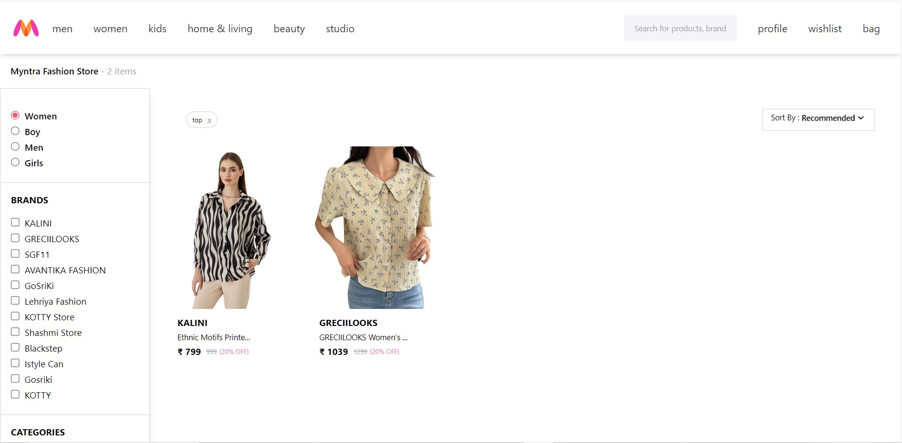

# Frontend Assignment
Its the clone of the Myntra shopping page, with the vast filtering features and the product display.

  

## Features
- Filter products based on 
    - Gender
    - Brand
    - Category
    - Color
    - Disccount range
    - Price range
- Sort products based on
    - Popularity
    - Trending
    - Recommended
- UI of Myntra is not perfectly responsive, still while building the project,
  responsiveness is taken care of.
- The sidebar behaves as a hamburger menu in mobile screens
- Different GRID view of products are displayed based on the screen size
- For better state management, Zustand is used though it has only single Landing page

## Technologies Used
- React
- Zustand
- TailwindCSS

## Installation
- Clone the repository
- Run `npm install`
- Run `npm run dev`